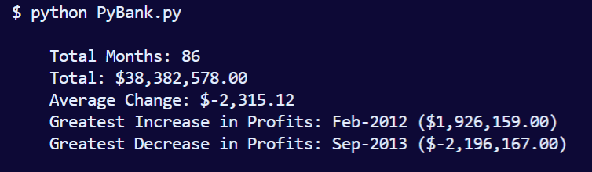
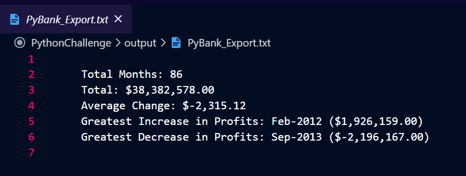
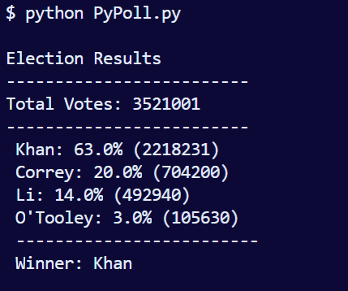
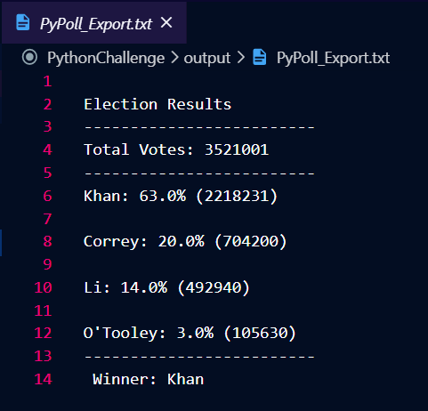

# Python Challenge
This project contains two Python scripts, each for analyzing a different dataset. "PyBank.py" analyzes fictional financial records (./data/budget_data.csv) and "PyPoll.py" analyzes fictional poll data (./data/election_data.csv). 

*This was a homework assignment for Washington Univeristy's Data Analytics Boot Camp 2019*

## Datasets
* election_data.csv
    * 86 rows
    * Columns: `Date` and `Profit/Losses`
    * Size: 1.46KB
* budget_data.csv
    * 3,521,000 rows
    * Columns: `Voter ID`, `County`, and `Candidate`
    * Size: 71.6MB

## Scripts
PyBank.py calculates the total number of months included in the dataset, the net total amount of "Profit/Losses" over the entire period, the average of the changes in "Profit/Losses" over the entire period, the greatest increase in profits (date and amount) over the entire period, and the greatest decrease in losses (date and amount) over the entire period.

PyPoll.py calcuates the total number of votes cast, a complete list of candidates who received votes, the percentage of votes each candidate won, the total number of votes each candidate won, and the winner of the election based on popular vote. 

Each script prints the calculations to the terminal and exports the calculations to a .csv file in "./output". Below are images of the output.

# PyBank (terminal ouput)

# PyBank (output .txt file)

# PyPoll (terminal ouput)

# PyPoll (output .txt file)
